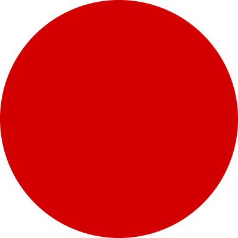
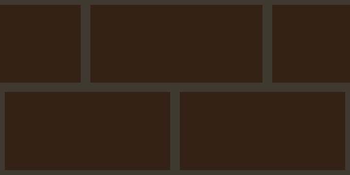
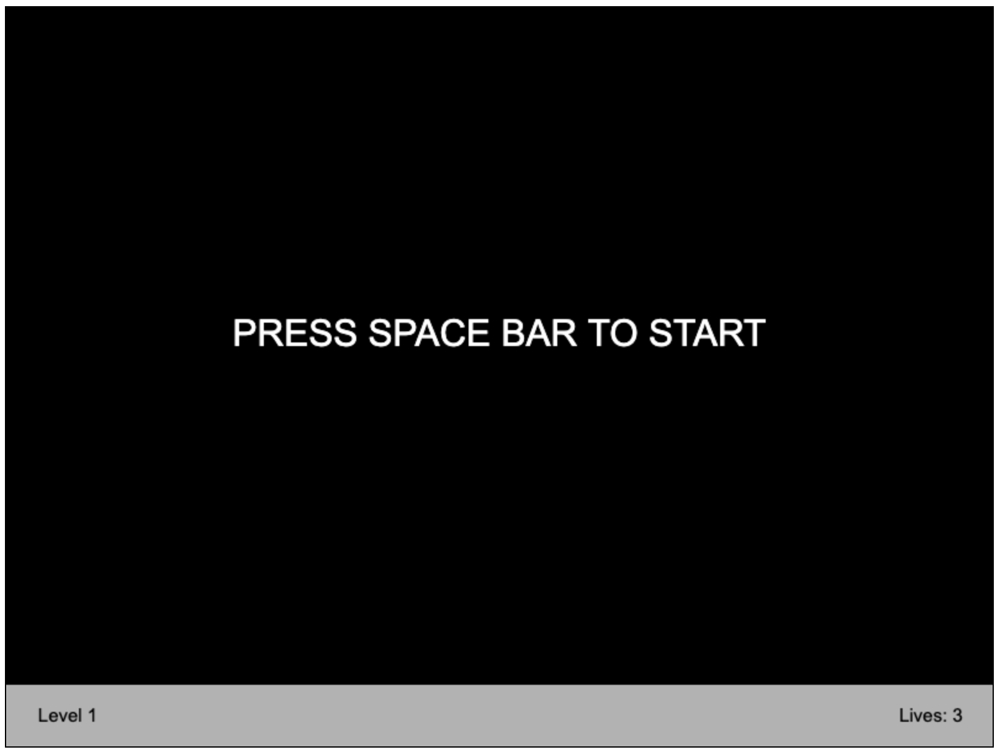
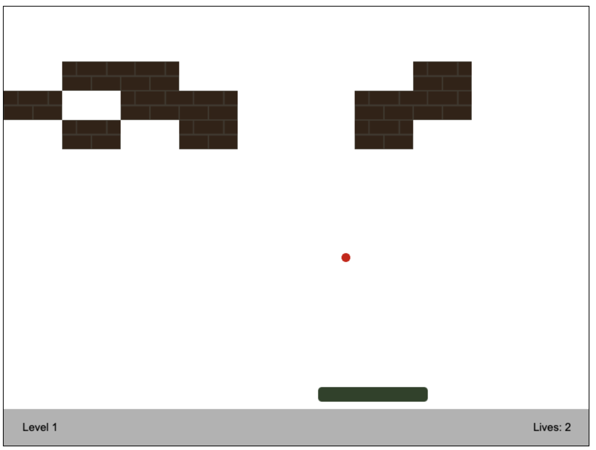
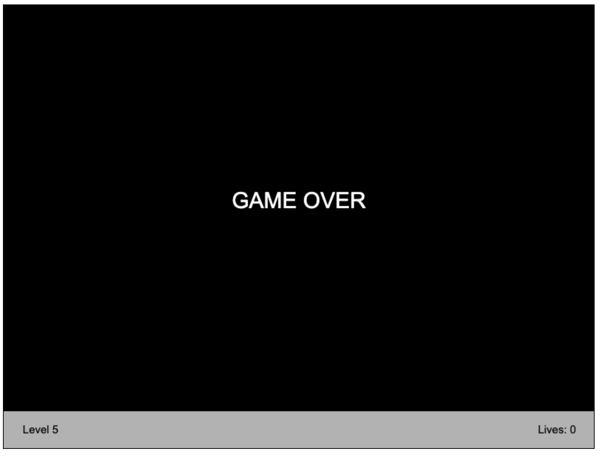
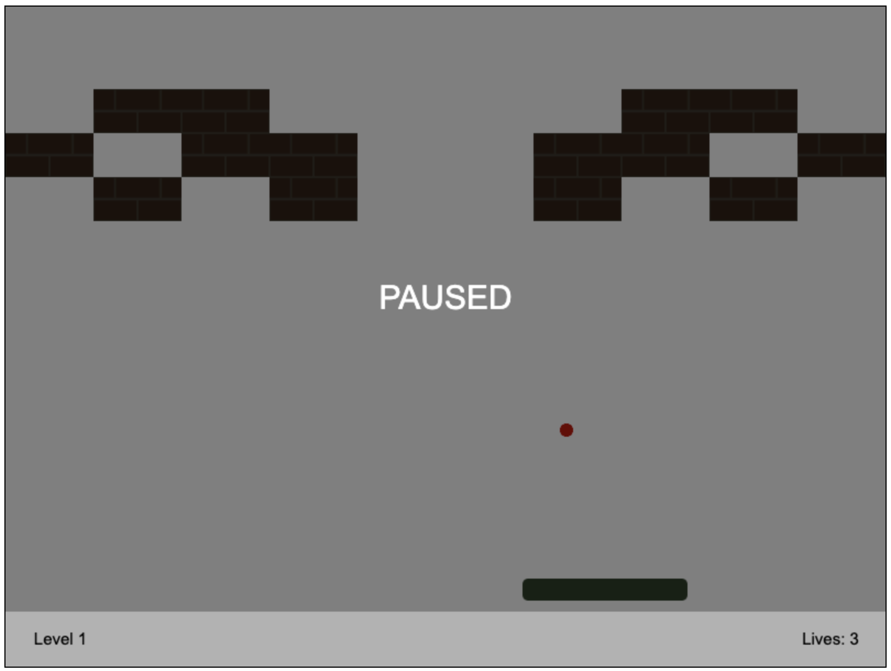
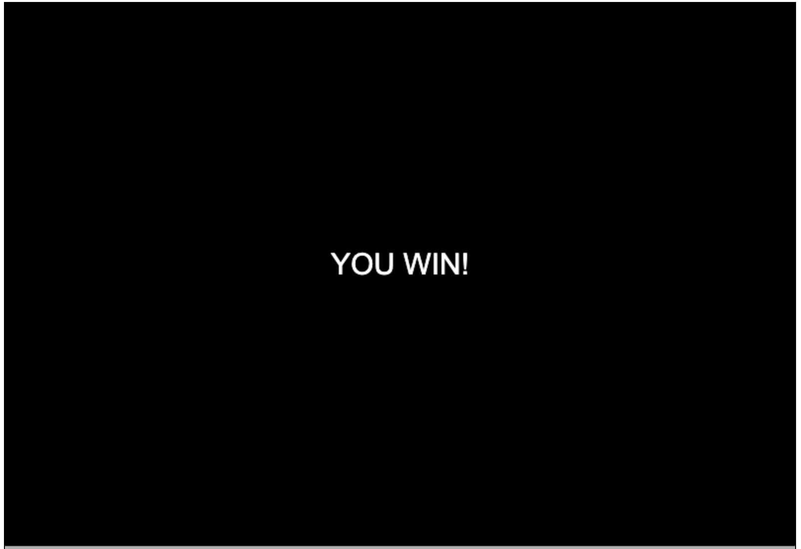

## Game Entities

1. Paddle
   <br><br>
   


2. Ball - changes the direction by Y-axis when hits bottom or top borders of other game objects, whenever the ball hits left of right side of game objects it changes direction by X-axis
   <br><br>
   

3. Brick - bricks are located in certain places on the playing field
   <br><br>
   

4. Borders of the game screen - borders that limit of game field

<br>

## Rules of the game

1. ### Start the game.
Pressing a space bar allows you to begin the game
<br><br>



2. ### Don't allow the ball to fall below the gaming paddle
If you don't catch the ball by gaming paddle - amount of lives are decreasing. At the start of each level you have three lives.



If you miss the ball three times - game is over 
<br><br>



3. ### You can pause the game if you want
If you want to pause the game - press the 'esc' button. When you will be ready to continue the playing process - press the 'esc' button again
<br><br>



4. ### Win the game by completing all levels!
There are 5 levels in this version of the game. You are going to the next level when you destroy all bricks on the level. If you complete all five levels you will face the "You win" screen. Congratulations!
<br><br>



## Controls

- 'space bar' - to begin the game, to go to the menu after losing/winning the game
- 'esc' - to pause the game
- 'arrow left'/'arrow right' - to move the paddle

<br>

## Technologies used

<br>

* HTML Canvas
* SCSS
* Java Script

<br>

## Project structure

<br>

All the main files are located in the ``` src ``` folder. Then the files are distributed to the appropriate folders.
- All .js files - ```js``` folder
- All images - ```images/content``` folder
- All css files - ```scss``` folder


<br>

## Project start and build

### Installation
---
1. Clone the repository
2. Install all dependencies using ``` npm install ``` command.


### Build Assets
---
#### One time build assets for development
```sh
$ npm run build
```

#### Start a development server
```sh
$ npm run dev
```
